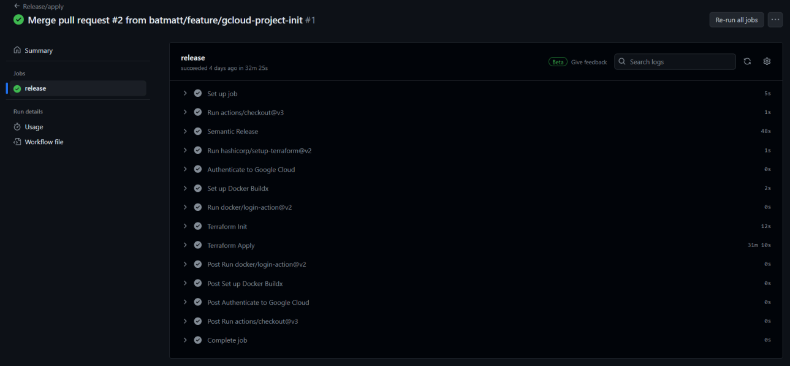
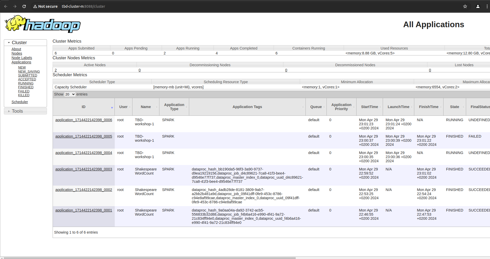
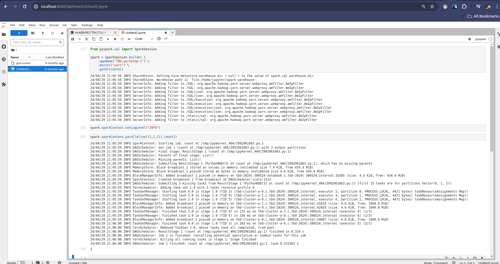

IMPORTANT ❗ ❗ ❗ Please remember to destroy all the resources after each work session. You can recreate infrastructure by creating new PR and merging it to master.
  


1. Authors:

   Zespół 11
   - Mateusz Winnicki
   - Bartosz Sweklej
   - Magdalena Lutyńska

   [link to forked repo](https://github.com/batmatt/tbd-workshop-1)
   
2. Follow all steps in README.md.

3. Select your project and set budget alerts on 5%, 25%, 50%, 80% of 50$ (in cloud console -> billing -> budget & alerts -> create buget; unclick discounts and promotions&others while creating budget).

  
  

5. From avaialble Github Actions select and run destroy on main branch.
   
7. Create new git branch and:
    1. Modify tasks-phase1.md file.
    
    2. Create PR from this branch to **YOUR** master and merge it to make new release. 
    
    ***place the screenshot from GA after succesfull application of release***
   


9. Analyze terraform code. Play with terraform plan, terraform graph to investigate different modules.

    ***describe one selected module and put the output of terraform graph for this module here***
   - bootstrap/main.tf:
     

   - grc/main.tf:
     
   
11. Reach YARN UI
   
   ***place the command you used for setting up the tunnel, the port and the screenshot of YARN UI here***
    
    Zestawienia tunelu:
    ```
    gcloud compute ssh tbd-cluster-m \
      --project=tbd-2024l-300524 \
      --zone=europe-west1-d -- -D 1080 -N
    ```
    Dostęp do YARN UI przez proxy na lokalnej przeglądarce:
    ```
    /usr/bin/google-chrome \
    --proxy-server="socks5://localhost:1080" \
    --user-data-dir="/tmp/tbd-cluster-m" http://tbd-cluster-m:8088
    ```
    
    
11. Draw an architecture diagram (e.g. in draw.io) that includes:
    1. VPC topology with service assignment to subnets
    2. Description of the components of service accounts
    3. List of buckets for disposal
    4. Description of network communication (ports, why it is necessary to specify the host for the driver) of Apache Spark running from Vertex AI Workbech
  
    ***place your diagram here***

12. Create a new PR and add costs by entering the expected consumption into Infracost
For all the resources of type: `google_artifact_registry`, `google_storage_bucket`, `google_service_networking_connection`
create a sample usage profiles and add it to the Infracost task in CI/CD pipeline. Usage file [example](https://github.com/infracost/infracost/blob/master/infracost-usage-example.yml) 

   ***place the expected consumption you entered here***
   ```version: 0.1
resource_usage:
  google_artifact_registry_repository.registry:
    storage_gb: 150
    monthly_egress_data_transfer_gb:
      europe_west1: 100
      us_central1: 50
      asia_east1: 30

  google_storage_bucket.tbd-state-bucket:
    storage_gb: 150
    monthly_class_a_operations: 40000
    monthly_class_b_operations: 20000
    monthly_data_retrieval_gb: 500
    monthly_egress_data_transfer_gb:
      same_continent: 550
      worldwide: 12500
      asia: 1500
      china: 50
      australia: 250

  google_storage_bucket.tbd-code-bucket:
    storage_gb: 200
    monthly_class_a_operations: 50000
    monthly_class_b_operations: 25000
    monthly_data_retrieval_gb: 750
    monthly_egress_data_transfer_gb:
      same_continent: 600
      worldwide: 13000
      asia: 1600
      china: 100
      australia: 300

  google_storage_bucket.tbd-data-bucket:
    storage_gb: 250
    monthly_class_a_operations: 45000
    monthly_class_b_operations: 30000
    monthly_data_retrieval_gb: 1000
    monthly_egress_data_transfer_gb:
      same_continent: 500
      worldwide: 12000
      asia: 1400
      china: 75
      australia: 275

  google_storage_bucket.notebook-conf-bucket:
    storage_gb: 180
    monthly_class_a_operations: 42000
    monthly_class_b_operations: 22000
    monthly_data_retrieval_gb: 550
    monthly_egress_data_transfer_gb:
      same_continent: 580
      worldwide: 12300
      asia: 1550
      china: 60
      australia: 260

  google_storage_bucket.mlflow_artifacts_bucket:
    storage_gb: 160
    monthly_class_a_operations: 38000
    monthly_class_b_operations: 21000
    monthly_data_retrieval_gb: 600
    monthly_egress_data_transfer_gb:
      same_continent: 560
      worldwide: 12700
      asia: 1500
      china: 55
      australia: 245

  google_service_networking_connection.private_vpc_connection:
    monthly_egress_data_transfer_gb:
      same_region: 250
      us_or_canada: 100
      europe: 70
      asia: 50
      south_america: 100
      oceania: 50
      worldwide: 200
```

   ***place the screenshot from infracost output here***
   Wynik estymacji Infracosta na PR dodającym Infracost (brak zmian w infrastrukturze)
   

   Wynik estymacji Infracosta na PR dodającym przykładowy plik testowy wprowadzjący zmiany w infrastrukturze: https://github.com/infracost/example-terraform/blob/master/google/main.tf
  
   
11. Create a BigQuery dataset and an external table using SQL
    
    ***place the code and output here***
    ```
    CREATE SCHEMA IF NOT EXISTS demo OPTIONS(location = 'europe-west1');

    CREATE OR REPLACE EXTERNAL TABLE demo.shakespeare
      OPTIONS (
      
      format = 'ORC',
      uris = ['gs://tbd-2024l-300524-data/data/shakespeare/*.orc']);


    SELECT * FROM demo.shakespeare ORDER BY sum_word_count DESC LIMIT 5;
    ```
     
   
    ***why does ORC not require a table schema?***
    
    Format ORC przechowuje schemat danych w samym pliku. Oznacza to, że każdy plik ORC zawiera metadane opisujące nazwy kolumn, typy danych i strukturę przechowywanych w nim danych. W rezultacie podczas odczytu danych schemat można pobrać bezpośrednio z pliku, eliminując potrzebę określania tych parametrów 'up-front' przy zapytaniu.
    
   

  
13. Start an interactive session from Vertex AI workbench:

    ***place the screenshot of notebook here***
   
   Zestawienie tunelu do połączenia z Vertex AI:
   ```
   gcloud compute --project "tbd-2024l-300524" ssh --zone "europe-west1-b" "tbd-2024l-300524-notebook" -- -L 8080:localhost:8080
   ```
   
15. Find and correct the error in spark-job.py

    ***describe the cause and how to find the error***

16. Additional tasks using Terraform:

    1. Add support for arbitrary machine types and worker nodes for a Dataproc cluster and JupyterLab instance

    [New machine types for Dataproc](https://github.com/batmatt/tbd-workshop-1/commit/db8f5a1ff30b6d642fe255de3220fd0747128e55)

    [Vertex AI machine type](https://github.com/batmatt/tbd-workshop-1/commit/87406a265b911fd7ce56972abb642a4fba080d44)
    
    2. Add support for preemptible/spot instances in a Dataproc cluster

    [Added preemptible instances in Dataproc](https://github.com/batmatt/tbd-workshop-1/commit/b8c72140665e08efd029a64293b522002a003b2a) 
    
    3. Perform additional hardening of Jupyterlab environment, i.e. disable sudo access and enable secure boot
    
    [No-sudo and secure boot for Jupyterlab](https://github.com/batmatt/tbd-workshop-1/commit/0dfa9ff85c45f97526bce730238c10a193c2c84e)

    4. (Optional) Get access to Apache Spark WebUI

    [Access to Apache Spark WebUI](https://github.com/batmatt/tbd-workshop-1/commit/954d9f6f9d7fae5c04b9263f441de9bf1d6c937b)
